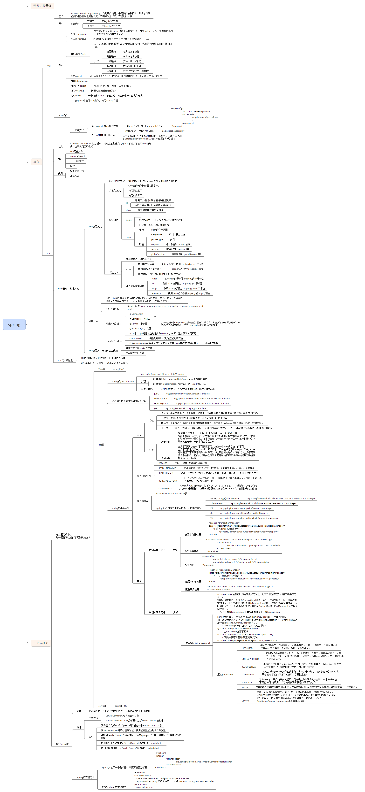
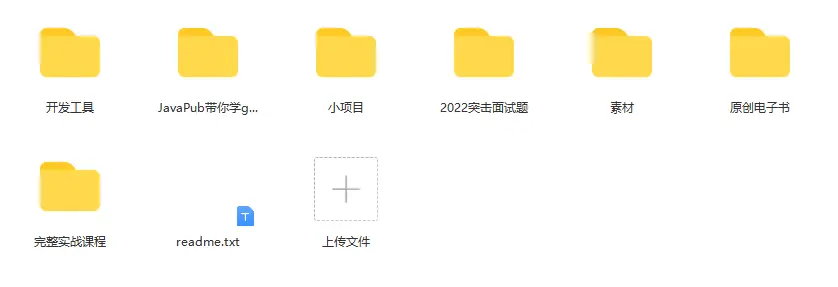

## [点击访问JavaPub官网网站 javapub.net.cn](https://javapub.net.cn)

---

[GitHub](https://github.com/Rodert/JavaPub) | [Gitee](https://gitee.com/rodert/JavaPub)

直接上干货，几百篇原创笔记都在这。

# 声明

大家好，我是 javapub。

JavaPub 这个号已经原创了上百篇文章了，超 10 万字！内容也比较多元，有学习经验、编程技巧、求职指南、各方向技术等。

今天整理下所有文章，帮助大家阅读，大家看一遍文章的标题，应该就知道是哪方面内容了~

为了加快访问速度，提升各位新老股东阅读体验，我对JavaPub做了一些完善，文末加王哥微信，看最少必要面试题。

> 需要项目源码，下滑到【web实战】

**【学习+实战+面试】一份涵盖大部分程序员需要掌握的核心知识，从基础到组件到项目源码。**

`善于使用 ctrl + f`

| 收录     | 地址                                       |
| -------- | ------------------------------------------ |
| 谷歌收录 | https://www.google.com.hk/search?q=javapub |
| 百度收录 | https://www.baidu.com/s?wd=javapub         |
| 必应收录 | https://www4.bing.com/search?q=javapub     |
| 360收录  | https://www.so.com/s?q=javapub             |
| 搜狗收录 | https://www.sogou.com/web?query=javapub    |

  
  
  
  
  <a href="">	

## 文章列表

###  📚最少必要面试题  ###

- [Java基础](https://mp.weixin.qq.com/s/3Nviyml0cvnX_HHkZ5DjWg)
- [Java并发入门](https://mp.weixin.qq.com/s/h2tTwDVqL15rCI6rftgn9A)
- [Java容器](https://mp.weixin.qq.com/s/ug3LBR4MfM1C5uVFJaPWLQ)
- [JavaWeb](https://mp.weixin.qq.com/s/59Tif95LGi8BTJXu47zi6g)
- [JVM](https://mp.weixin.qq.com/s/hvsaD1NlzpR0LpP-GmbU_A)
- [MySQL](https://mp.weixin.qq.com/s/yVPwCoSQ-8OYvhw8bH0PtA)
- [MyBatis](https://mp.weixin.qq.com/s/lVFwy765hQ2FvIYBHyw0yA)
- [Spring](https://mp.weixin.qq.com/s/lrHsLZANxHxd_FWTCdMNJw)
- [SpringBoot](https://mp.weixin.qq.com/s/-oYKVXBaQwzyzp7ffqH7gw)
- [Redis](https://mp.weixin.qq.com/s/_Pq2VgxRA4yw1j_eCfEiLg)
- [ElasticSearch](https://mp.weixin.qq.com/s/z3D37HqeTUmwrdheUL_Efw)
- [Kafka](https://javapub.blog.csdn.net/category_11740063.html)
- [Zookeeper](https://mp.weixin.qq.com/s/ym0-x6okFi0CgF8RcxeLFA)
- [Docker](https://mp.weixin.qq.com/s/DTC3gZNHm3Rlf_GK7twlkQ)
- [缓存](https://mp.weixin.qq.com/s/EnCBbpRuXj_E8kfsaJMeqg)

###  📖知识点总结  ###

> 下面是原创**PDF**干货版，持续更新中。

- [51页的MyBatis](https://mp.weixin.qq.com/s/op9ADw_6U5MhbcUlkFtOUQ)

- [14页的zookeeper总结](https://mp.weixin.qq.com/s/HfZ3nmTqCYHRhUkoSMEZAg)

...

###  ☕️Java基础  ###

#### 锁 ####

- [volatile关键字的作用](https://mp.weixin.qq.com/s/nNHr4bTLLVht_PiLWr0kQA)

#### jdk8 ####

- [原来ThreadLocal的Lambda构造方式这么简单](https://mp.weixin.qq.com/s/bXx5jBpghfR83uo6zrilrQ)

###  📝数据结构与算法  ###

1. [冒泡排序就是这么容易](https://mp.weixin.qq.com/s/ptxxmbfqndZeFHAfm3hdkw)
2. [选择排序就是这么容易](https://mp.weixin.qq.com/s/EirRqU1F6Zv0JLIfjJyC6w)
3. [插入排序就是这么容易](https://mp.weixin.qq.com/s/cCv5s7b_ACF3mZo6wSfOIA)
4. [希尔排序就是这么容易](https://mp.weixin.qq.com/s/x5nAtijd_zbOI4V2Z1xM1Q)
5. [归并排序就是这么容易](https://mp.weixin.qq.com/s/VM9R4Y3uvFcmRuvmoWxLdw)
6. [快速排序就是这么容易](https://mp.weixin.qq.com/s/DyUR6khAHdcKzHg7owHtlQ)
7. [堆排序就是这么容易](https://mp.weixin.qq.com/s/yxYz2kbqu-W7aeFvFv05BQ)
8. [计数排序就是这么容易](https://mp.weixin.qq.com/s/7lphoHUgfDu0Cb1cO8ExKA)
9. [桶排序就是这么容易](https://mp.weixin.qq.com/s/10GFjOZ2VgA06hWe_wkmwQ)
10. [基数排序就是这么容易](https://mp.weixin.qq.com/s/z4jzP2cew8lMWRgD7H-6JA)
- [rodert熬夜写了一份BloomFilter总结](https://mp.weixin.qq.com/s/6S9eu_eLBDxeetygulmHBw)
- [哈希算法篇 - 布隆过滤器](https://mp.weixin.qq.com/s/bj5s0jBSu4P9WbSN1sTFPA)
- [B树和B+树的区别](https://mp.weixin.qq.com/s/RWkc2lNarKnn8Dc0HrP58g)

###  📣Mybatis  ###

- [rodert熬夜写了一份Mybatis总结](https://mp.weixin.qq.com/s/op9ADw_6U5MhbcUlkFtOUQ)
- [MyBatis SQL 批量更新（代码+案例）](https://mp.weixin.qq.com/s/VYvciG9iOz1VwCPBzoQdhw)
- 

###  🔬搜索  ###
####  Lucene  ####

- [Lucene就是这么容易](https://mp.weixin.qq.com/s/AhirDnW4ul5xR1bBtKqtFQ)

####  Elasticsearch  ####

- [Springboot2.x整合ElasticSearch7.x实战目录](https://mp.weixin.qq.com/s/nSWEIfbpRf-4txJqRz60gQ)
- [Springboot2.x整合ElasticSearch7.x实战（一）](https://mp.weixin.qq.com/s/4azw3QycpqrprABNdo44Zg)
- [Springboot2.x整合ElasticSearch7.x实战（二）](https://mp.weixin.qq.com/s/R7bFN9pSA4XFVdZMfzYz_w)
- [Springboot2.x整合ElasticSearch7.x实战（三）](https://mp.weixin.qq.com/s/6qSSWGnxmiLjnaM-m1_wUQ)

###  🎩Spring  ###

Spring 学习路线图：

- [一篇告诉你什么是Spring](https://mp.weixin.qq.com/s/5nj-AAekF8j5KL6J67UZKA)
- [第一个Spring程序(代码篇)](https://mp.weixin.qq.com/s/_T9g67UUI3ao33Ug1PNo_Q)
- [手把手整合SSM框架-附源码](https://mp.weixin.qq.com/s/qikPY9ymX4LTgLunrD8vUQ)

- [公司这套架构统一处理 try...catch 这么香，求求你不要再满屏写了，再发现扣绩效！(全局异常处理)](https://mp.weixin.qq.com/s/KjpZQX5-cHDWyiytkAQbFw)
- [CTO 说了，如果发现谁用 kill -9 关闭程序就开除](https://mp.weixin.qq.com/s/1Oyt8mn11wztY3zBWTEKkg)
- [spring的controller是单例还是多例？怎么保证并发的安全](https://mp.weixin.qq.com/s/z8OmcbgGI7GGBrbCqCNXbw)
- [真的！@Autowired和@Resource注解别再用错了！](https://mp.weixin.qq.com/s/6FycP6xVm5KQ9XoVn0KZ0Q)

#### Spring Boot ####

SpringBoot最新版常用案例整合，持续更新中 **https://github.com/Rodert/SpringBoot-javapub**

- [SpringBoot快速入门-附源码](https://mp.weixin.qq.com/s/jtnwb1pTrjXiFc9EvWwLnQ)
- [Springboot项目的接口防刷](https://mp.weixin.qq.com/s/ihqyJTievMCTBXlA6QgaBA)
- [SpringBoot 中的线程池，你真的会用么](https://mp.weixin.qq.com/s/kqFEKJ_PrlhqnrkCYBomYQ)
- [docker 打包 springboot 项目快速入门](https://mp.weixin.qq.com/s/kCdqHqPqiqXYGvsD267Adw)
- [自定义注解+AOP切面日志+源码](https://mp.weixin.qq.com/s/onYeB2EMRIsZS1j86X0ijA)
- [SpringBoot2.x整合Prometheus+Grafana【附源码+视频】](https://mp.weixin.qq.com/s/P-sKokWMf1kKIKK2mAdSZw)

###  💞中间件  ###
####  zookeeper  ####
- [rodert熬夜写了一份zookeeper总结](https://mp.weixin.qq.com/s/HfZ3nmTqCYHRhUkoSMEZAg)

####  RocketMQ  ####
- [RocketMq 快速入门教程](https://mp.weixin.qq.com/s/kmUlX-5CtWVn0Qli1iyWng)

#### Prometheus ####

- [SpringBoot2.x整合Prometheus+Grafana【附源码+视频】](https://mp.weixin.qq.com/s/P-sKokWMf1kKIKK2mAdSZw)

#### 流程引擎 ####

- [老板要我开发一个简单的工作流引擎](https://mp.weixin.qq.com/s/fpEQqMIVdVxZ8z5WY40cug)
- [手把手实现springboot整合flowable、附源码-视频教程](https://mp.weixin.qq.com/s/hWwzSu-SlyTzzzHUrA7OXQ)

###  💍Redis  ###

- [rodert单排学习redis入门【黑铁】](https://mp.weixin.qq.com/s/lpYemCdb1KsE32UTTdxuxg)
- [rodert 单排学习 redis 进阶【青铜】](https://mp.weixin.qq.com/s/S2qZiJG-_HgW3ET9Sl0EAg)
- [rodert单排学习redis进阶【白银一】](https://mp.weixin.qq.com/s/hXkoUOJCl8zxDinS878Sqw)
- [rodert熬夜写了一份BloomFilter总结](https://mp.weixin.qq.com/s/6b5y8l9qIoD6VXdDZuIgBQ)
- [了解Redis过期策略及实现原理](https://mp.weixin.qq.com/s/GFtaDZb68XcoVQn6F2U_0Q)
- [缓存：热点key重建优化](https://mp.weixin.qq.com/s/_AfOygfCd-pCJ1lh2p-q0A)
- [记一次redis线上问题](https://mp.weixin.qq.com/s/blf1a6cP-oJQ9FmnpU_ocw)
- [了解Redis过期策略及实现原理](https://mp.weixin.qq.com/s/GFtaDZb68XcoVQn6F2U_0Q)

###  📚Docker  ###

- [docker 打包 springboot 项目快速入门](https://mp.weixin.qq.com/s/kCdqHqPqiqXYGvsD267Adw)
- 

###  📚sql  ###

- [求求你不要再用offset和limit了](https://mp.weixin.qq.com/s/I6MJRMNy4G2yj3BlXghyFA)
- [慢查询优化方案-SQL篇【JavaPub版】](https://mp.weixin.qq.com/s/2ZoMtoA4MQVxOun2HPbVfQ)
- [分表分库解决思路](https://mp.weixin.qq.com/s/jt5oyx3oyC2uORXx8bk4UA)
- [如果mysql磁盘满了，会发生什么？还真被我遇到了！](https://mp.weixin.qq.com/s/mucnXyAcyFHGmA47GT-uig)

###  📚设计模式  ###

- [优雅的替换if-else语句](https://mp.weixin.qq.com/s/nVl2wb1Pr2tChy6kYw51MQ)
- [单例模式 --- 生产环境怎么用](https://mp.weixin.qq.com/s/s1cwut9WvUSrMYw_6UK3sg)

###  🔒分布式  ###

- [分布式唯一ID解决方案-雪花算法](https://mp.weixin.qq.com/s/k-x6Wz7ibEIGbRWN55YpnQ)

###  🌋shell  ###

- [jar包shell启动脚本](https://mp.weixin.qq.com/s/j6BeXX9sYUop-AomkQY4-Q)

###  ⚡️常用工具  ###
#### Git ####

- [Git【入门】这一篇就够了](https://mp.weixin.qq.com/s/keQpwkwXbiUxsjQNxse2mw)
- [国内加速访问Github的办法，超级简单](https://mp.weixin.qq.com/s/Wx1Q-pFUi5SWHoGKAFd3pg)
- [企业级git组合命令](https://mp.weixin.qq.com/s/ouYfFWEP3ORsN6wZhYf0Xw)
- [基于 Gitee 搭建个人网站-入门教程](https://mp.weixin.qq.com/s/zr-aDM3SwUi72aUj5X1htw)

#### shell ####

- [代替xshell的国产免费工具](https://mp.weixin.qq.com/s/IKgP9ZlHBj0yo1mnLtjVWg)

#### linux  ####

- [史上最全win10下Linux子系统的安装及优化方案](https://mp.weixin.qq.com/s/jq6oz7L07WZqLS8WPwzGyA)

#### ffmpeg  ####

- [rodert教你学FFmpeg实战这一篇就够了](https://mp.weixin.qq.com/s/x5TRlRtzayWZLbRqe-eEpA)

#### 实用工具  ####

- [压箱底的10款在线工具平台](https://mp.weixin.qq.com/s/PxvcpSWDoOOkgRTYCYVciw)
- [离线IP地址定位库](https://mp.weixin.qq.com/s/j3a9JW8lzhh6ZVhBARgecw)

###  🌋加密  ###

- [FPE格式保留加密](https://mp.weixin.qq.com/s/i0NGn_B2fFVS86jlf4qGJw)

###  🔒GoLang  ###

- [Java急速转职GoLang工程师资料-入门篇](https://mp.weixin.qq.com/s/B0F4JpmLfrSjIlGiFsjUhA)

### 📚前端  ###

- [网站都变灰色了，1分钟教你实现](https://mp.weixin.qq.com/s/zERj4VUoiagMhvCZaa8v7g)
- 

###  💞区块链  ###

- [这破玩意就是区块链？](https://mp.weixin.qq.com/s/AZYDePT-dZuPp-0gGlCHzA)

###  🤖web实战  ###

**下载地址：** [github](https://github.com/Rodert/JavaPub-Web)  | [gitee](https://gitee.com/rodert/JavaPub-Web)

- [SSM项目合集（公众号领取）]()
- [基于SSM图书馆管理系统](https://mp.weixin.qq.com/s/rydMsMCGZG5F-F-LpXS_0A)
- [私活利器 时薪翻一番，推荐几个SpringBoot项目，建议你改改](https://mp.weixin.qq.com/s/_98QkdxnDZcORMCGWb44VQ)
- [16K点赞 基于Spring + Vue的前后端分离管理系统ELAdmin，真香](https://mp.weixin.qq.com/s/xW6H7Zv06jQYPbFPzHmcsw)
- [Spring Boot + Security + MyBatis + Thymeleaf + Activiti 快速开发平台项目](https://mp.weixin.qq.com/s/2ER31ZqgakXM6HjHI7-ckg)
- [一款基于 Spring Boot 的现代化社区（论坛/问答/社交网络/博客）](https://mp.weixin.qq.com/s/iyaD_KL-QCmhkhdNgPcQlg)
- [决定做一个开源项目](https://mp.weixin.qq.com/s/EcstWlAPtGbE9enfUGrqpA)

###  🚀实战面试  ###
- [Java 同学注意！这不是演习](https://mp.weixin.qq.com/s/RfQNwMdSLhvzza9zggjjaQ)

####  20212021 Java面试题系列教程  ####

- [Java基础--2021面试题系列教程--大白话解读--JavaPUb版本](https://mp.weixin.qq.com/s/Ogxm1whPUyCnnuBmBWUK1A)
- [Java容器--2021面试题系列教程（附答案解析）--大白话解读--JavaPub版本](https://mp.weixin.qq.com/s/6zjw2coKzlkoKATNMJ43lQ)
- [Java反射--2021面试题系列教程--大白话解读--JavaPub版本](https://mp.weixin.qq.com/s/xk7eU4uhDcCJRZNbcweqLw)
- 

### 🚀源码 ###

#### guava ####

- [guava中Lists.newArrayListWithCapacity()的作用和实现原理](https://mp.weixin.qq.com/s/xwbx43fLL0I0CjCqz_jvhg)
- 

### 🌊杂文随笔 ###

- [拒绝网贷](https://mp.weixin.qq.com/s/Qfz3ZwIRkKeigH8RxT_cbQ)
- [我的炒股生涯（非广告）](https://mp.weixin.qq.com/s/GsdjlkdOYkQbAEV2w6o01A)
- [平安夜有话想对你说](https://mp.weixin.qq.com/s/dog6TAbLUIHpVazmnhxC5Q)
- [没有一个人可以瘦着过完春节](https://mp.weixin.qq.com/s/0GRESHMDI5r1pxj94E7cEA)
- [一个中科大差生的8年程序员工作总结](https://mp.weixin.qq.com/s/SnsH9klKQM96fd2vYZpw4Q)
- [国企程序员是一种怎样的体验](https://mp.weixin.qq.com/s/XJ4r-Xhkyu6fpoPbq2PW6g)
- [越努力，](https://mp.weixin.qq.com/s/YdeXrlSNSgqcALL-ZURYmg)
- [一个员工的离职成本到底有多高？](https://mp.weixin.qq.com/s/TCUP-LSzM3EEBdOTb9FaNA)
- [原来我是个厨子](https://mp.weixin.qq.com/s/taZOW8US6W6vfUh8C7wdoQ)
- [周末](https://mp.weixin.qq.com/s/r_dqtPDmWgbfLInbHoNJKg)
- [闲扯](https://mp.weixin.qq.com/s/iiFwx01ngNylCfD6h77OTw)
- [我出来了](https://mp.weixin.qq.com/s/06Lm-K7r98b4bL-O3xtnRA)
- [我的网站正式上线了](https://mp.weixin.qq.com/s/FPXO8KPO0qzT7_SuODXeOQ)
- [近况](https://mp.weixin.qq.com/s/ufPAfaBmf1aYppIIRoGh1g)
- 

####  福利  ####

- [100个实战项目免费领取（非广告）](https://mp.weixin.qq.com/s/-MKinm7PLPxfcQwCJte6AQ)

##  关于JavaPub  ##

>**纯手打原创电子书**，**致力于最实用教程**，不需要什么奖励，只希望多多**转发支持**。

前后端分离项目：俩万

[GitHub](https://github.com/Rodert/liawan-vue) | [Gitee](https://gitee.com/rodert/liawan-vue)

目前实现的功能及带实现列表

## 推荐练手项目（附源码-附安装视频）

`无套路，免费领取`

中国象棋：[下载地址1](https://javapub.blog.csdn.net/article/details/124503370) | [下载地址2](http://javapub.net.cn/project/game/chinese-chess-game.html)

植物大战僵尸：[下载地址1](https://javapub.blog.csdn.net/article/details/124238828) | [下载地址2](http://javapub.net.cn/project/game/plants-vs-zombies-game.html)

俄罗斯方块：[下载地址1](https://javapub.blog.csdn.net/article/details/124471774) | [下载地址2](http://javapub.net.cn/project/game/super-mario-game.html)

超级马里奥：[下载地址1](https://javapub.blog.csdn.net/article/details/124463555) | [下载地址2](http://javapub.net.cn/project/game/super-mario-game.html)

吃豆人游戏：[下载地址1](https://javapub.blog.csdn.net/article/details/124463461) | [下载地址2](http://javapub.net.cn/project/game/super-mario-game.html)

打地鼠：[下载地址1](https://javapub.blog.csdn.net/article/details/124463376) | [下载地址2](http://javapub.net.cn/project/game/super-mario-game.html)

捕鱼达人：[下载地址1](https://javapub.blog.csdn.net/article/details/123834030) | [下载地址2](http://javapub.net.cn/project/game/catch-fish-game.html)

打飞机：[下载地址1](https://javapub.blog.csdn.net/article/details/123699508) | [下载地址2](http://javapub.net.cn/project/game/super-mario-game.html)

坦克大战：[下载地址1](https://javapub.blog.csdn.net/article/details/123779963) | [下载地址2](http://javapub.net.cn/project/game/super-mario-game.html)

1024：[下载地址1](https://javapub.blog.csdn.net/article/details/123832950) | [下载地址2](http://javapub.net.cn/project/game/super-mario-game.html)

贪吃蛇：[下载地址1](https://javapub.blog.csdn.net/article/details/123833575) | [下载地址2](http://javapub.net.cn/project/game/super-mario-game.html)

3D赛车：[下载地址1](https://javapub.blog.csdn.net/article/details/124462822) | [下载地址2](http://javapub.net.cn/project/game/3d-racing-game.html)

汇总地址：[下载地址1](https://blog.csdn.net/qq_40374604/category_11788364.html) | [下载地址2](http://javapub.net.cn/category/%E5%B0%8F%E6%B8%B8%E6%88%8F/)

---

低谷蓄力

**《最少必要面试题》**

[10道不得不会的Java基础面试题](https://mp.weixin.qq.com/s/3Nviyml0cvnX_HHkZ5DjWg)

[10道不得不会的Java并发基础面试题](https://mp.weixin.qq.com/s/h2tTwDVqL15rCI6rftgn9A)

[10道不得不会的JavaEE面试题](https://mp.weixin.qq.com/s/59Tif95LGi8BTJXu47zi6g)

[10道不得不会的JVM面试题](https://mp.weixin.qq.com/s/hvsaD1NlzpR0LpP-GmbU_A)

[10道不得不会的MySQL基础面试题](https://mp.weixin.qq.com/s/yVPwCoSQ-8OYvhw8bH0PtA)

[10道不得不会的MyBatis面试题](https://mp.weixin.qq.com/s/lVFwy765hQ2FvIYBHyw0yA)

[10道不得不会的Spring面试题](https://mp.weixin.qq.com/s/lrHsLZANxHxd_FWTCdMNJw)

[10道不得不会的ElasticSearch面试题](https://mp.weixin.qq.com/s/z3D37HqeTUmwrdheUL_Efw)

[10道不得不会的Redis面试题](https://mp.weixin.qq.com/s/_Pq2VgxRA4yw1j_eCfEiLg)

[10道不得不会的Kafka面试题](https://javapub.blog.csdn.net/category_11740063.html)

[10道不得不会的Zookeeper面试题](https://mp.weixin.qq.com/s/ym0-x6okFi0CgF8RcxeLFA)

[10道不得不会的Docker面试题](https://mp.weixin.qq.com/s/DTC3gZNHm3Rlf_GK7twlkQ)

**《面试1v1》Java面试八股文**

《面试1v1》是我在面试中总结和推理出来的，准备在跳槽时温习回顾使用。

它采用对话的方式、口语化描述技术点，这里没有花费长篇大论的描述 API 怎么用，主要涉及到的都是**高频**面试题、及工作中如何使用，我还穿插了部分源码解析，因为现在面试中八股文必不可少，让文章由浅入深的更好理解。模拟了在真实面试场景中，候选人该如何回答。

迫不及待要看 **面试1v1** 全集怎么办？ 目前在持续更新中，我一般会先更新到公众号，提催更

**什么是《面试1v1》？**

《面试1v1》是一个以对话形式讲解知识点的文章合集，是由 JavaPub 编写的真人1对1面试对话教程，通过真实案例编写，生动、有趣、干货满满。

**为什么要写《面试1v1》这个专题？**

我在后台收到很多读者的描述，说自己在面试准备过程中感觉抓不住重点，总是复习的没考、考的没复习。面试过后导致自己自信心受挫，不知道🤷‍♀️该看点什么来。

这里主要以我的经验给大家一个参照，我们如何在面试中自然的对答，不会因为紧张的忘记。如果用自己的话描述技术难题，避免背课文式的对话。

**《面试1v1》有什么用？**

文中大多是以实际面试中遇到的情况编写，几乎是大白话式的对话。涉及到的源码我也在对话中做了标注，方便我们查阅遗忘的知识点。

最终的目标是帮助大家更好的掌控面试，拿到心仪offer。

**《面试1v1》收费吗，在哪里可以看到全集？**

由 JavaPub 完全免费提供，并且持续更新中，在 wx 搜索 JavaPub 就可以直接查看全系列文章。

**面试1v1 之后会出第二季吗？**

会的，第二季会从大白话源码的角度出发，八股文的朋友不要错过。

[【面试1v1】hashmap](https://mp.weixin.qq.com/s/BnX1Nmt296zlYSnbq34oUQ)

[【面试1v1】java注解](https://mp.weixin.qq.com/s/5viBOy9h92npuSBT4Ht8XA)

[【面试1v1】java泛型](https://mp.weixin.qq.com/s/ZPvL8W3zBenz3oQdsy6LtA)

[【面试1v1】java多线程](https://mp.weixin.qq.com/s/wp8uym6oUooR868H2ycoLg)

[【面试1v1】CAS](https://mp.weixin.qq.com/s/j8yLPicPKwTnwnBm7_ZFOA)

[【面试1v1】java反射](https://mp.weixin.qq.com/s/O0L2a1EoVO2UBo46wEl99Q)

[【面试1v1】动态代理](https://mp.weixin.qq.com/s/dsBF6HRcIpJBp3OVmJWS-A)

[【面试1v1】javaNIO](https://mp.weixin.qq.com/s/MzgMLpEfcnj7GY4HAchvkQ)

[【面试1v1】synchronized](https://mp.weixin.qq.com/s/8MSLTO_w2obOLgCgwp8XNA)

[【面试1v1】volatile](https://mp.weixin.qq.com/s/0FBa1_BamrsvzvRNNeC_dQ)

[【面试1v1】线程池](https://mp.weixin.qq.com/s/DEfxLzR0t8wCWI1eUFEsww)

[【面试1v1】ThreadLocal](https://mp.weixin.qq.com/template/article/1684030474/index.html)

[【面试1v1】JVM内存模型](https://mp.weixin.qq.com/s/Tw97nlAr13PqGFxijIHO0A)

[【面试1v1】CountDownLatch-CyclicBarrier](https://mp.weixin.qq.com/s/e9-X5RtU3XJd7XB6sdmzyQ)

**我的原创电子书**

链接：https://pan.baidu.com/s/11kIaq5V6A_pFX3yVoTUvzA 提取码：java

看到这里了，点个关注呗！双击即可点赞！关注 @JavaPub

我是 JavaPub，夜跑6公里的 markdown 程序员。

##  关于JavaPub  ##

>**纯手打原创电子书**，**致力于最实用教程**，不需要什么奖励，只希望多多**转发支持**。

欢迎来到我公众号，微信搜索：**JavaPub**，回复：【**666**】即可领取

## Star History

